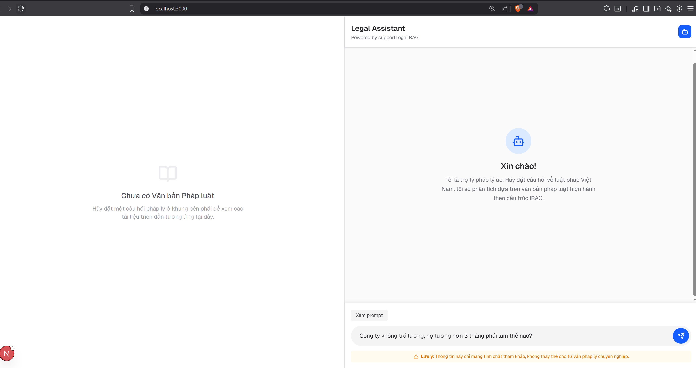
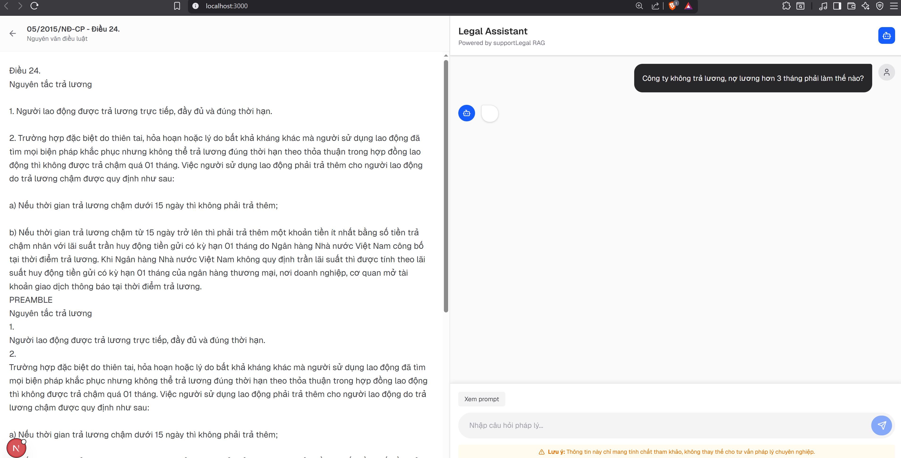
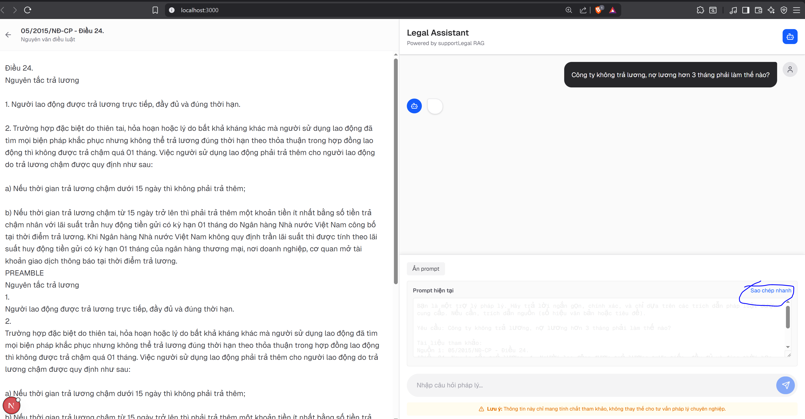
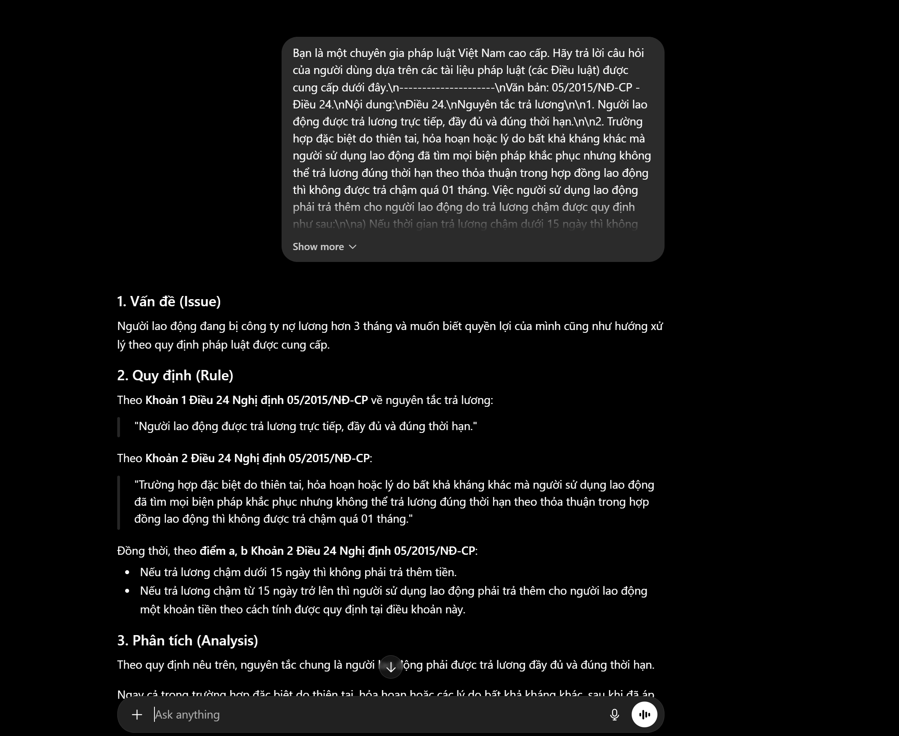
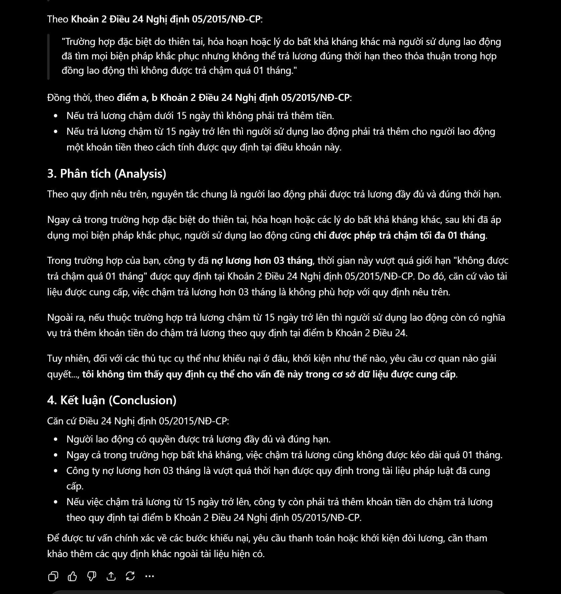

# supportLegal - Hệ thống RAG Pháp luật Việt Nam

Dự án **supportLegal** là một hệ thống RAG (Retrieval-Augmented Generation) tiên tiến giúp tìm kiếm và trả lời các câu hỏi về luật pháp Việt Nam theo mô hình cấu trúc **IRAC** (Issue - Vấn đề, Rule - Quy định, Analysis - Phân tích, Conclusion - Kết luận). Hệ thống sử dụng cơ chế tìm kiếm lai (Hybrid Search) kết hợp giữa tìm kiếm ngữ nghĩa (Vector Search) và tìm kiếm từ khóa (Keyword Search).

Dưới đây là hướng dẫn chi tiết giúp bạn thiết lập và chạy hệ thống trên môi trường máy cá nhân (Local).

---

## 📸 Demo Giao Diện Hệ Thống

Dưới đây là một số hình ảnh thực tế của hệ thống được trích xuất từ thư mục `result/`:

```carousel

<!-- slide -->

<!-- slide -->

<!-- slide -->

<!-- slide -->

```

---

## 🛠️ Kiến Trúc và Luồng Xử Lý
Hệ thống hoạt động theo quy trình sau:
1. **Query Classifier (Phân loại câu hỏi)**: Nhận câu hỏi từ người dùng, dùng LLM để phân loại chủ đề luật (Hình sự, Dân sự, Đất đai, Kinh doanh, Lao động, Hành chính...) giúp định vị chính xác vùng dữ liệu cần truy vấn.
2. **Hybrid Search (Tìm kiếm lai)**:
   - **Vector Search**: Sử dụng Qdrant DB để tìm kiếm ngữ nghĩa dựa trên dense embeddings được sinh ra từ mô hình `bkai-foundation-models/vietnamese-bi-encoder`.
   - **Keyword Search**: Sử dụng SQLite FTS5 để tìm kiếm từ khóa chính xác trên tiêu đề và nội dung điều luật.
3. **RRF Fusion (Hợp nhất kết quả)**: Áp dụng thuật toán Reciprocal Rank Fusion (RRF) để gộp và xếp hạng các tài liệu liên quan nhất.
4. **IRAC Generation**: Đưa các điều luật tìm được làm ngữ cảnh (Context) vào LLM (Gemini, Groq, DeepSeek) để tạo ra câu trả lời chuẩn cấu trúc pháp lý.

---

## 🚀 Hướng Dẫn Cài Đặt Chi Tiết

### Bước 1: Khởi động các dịch vụ Hạ tầng (Docker)
Hệ thống sử dụng Docker để vận hành Vector DB (Qdrant), Semantic Cache (Redis Stack) và cơ sở dữ liệu Postgres (dành cho indexer nâng cao).

Chạy lệnh sau tại thư mục gốc dự án:
```bash
docker compose up -d
```

Các dịch vụ sẽ được chạy trên local với các cổng mặc định:
- **Qdrant**: REST API (`6333`), gRPC (`6334`)
- **Redis**: Cổng `6379`, RedisInsight UI cổng `8001` (dùng để quản lý cache)
- **PostgreSQL**: Cổng `5432`

---

### Bước 2: Cấu hình Môi trường Python Backend
1. **Tạo môi trường ảo (Virtual Environment):**
   - **Windows:**
     ```bash
     python -m venv .venv
     .venv\Scripts\activate
     ```
   - **macOS/Linux:**
     ```bash
     python3 -m venv .venv
     source .venv/bin/activate
     ```

2. **Cài đặt các thư viện phụ thuộc:**
   ```bash
   pip install -r requirements.txt
   ```
   *(requirements.txt đã được tối ưu hóa để tự động cài đặt phiên bản PyTorch CPU cho môi trường Windows local nhằm giảm thiểu thời gian cài đặt)*

---

### Bước 3: Thiết lập biến môi trường `.env`
Sao chép file `.env.example` thành `.env` tại thư mục gốc:
```bash
cp .env.example .env
```

Mở file `.env` lên và điền/chỉnh sửa các thông số sau:
1. **Cấu hình API Key cho LLM (chọn ít nhất một nhà cung cấp): có thể không cài nếu không có api key call LLM**
   ```env
   GEMINI_API_KEY=your_gemini_api_key
   # Hoặc Groq/DeepSeek nếu sử dụng:
   GROQ_API_KEY=your_groq_api_key
   DEEPSEEK_API_KEY=your_deepseek_api_key
   ```
2. **Cấu hình kết nối local Qdrant:**
   Vì chạy backend trực tiếp ngoài Docker (môi trường host), bạn cần đổi host của Qdrant về `localhost`:
   ```env
   QDRANT_HOST=localhost
   QDRANT_PORT=6334
   ```
3. **Cấu hình LLM sinh câu trả lời (LLM Generation):**
   - `ENABLE_LLM_GENERATION=true` để backend tự động gọi LLM và trả về câu trả lời.
   - Nếu để `false` (mặc định), backend sẽ chỉ trả về prompt mẫu và danh sách trích dẫn nguồn (citations), người dùng có thể nhấp vào nút "Xem prompt" ở giao diện để copy thủ công và dán vào LLM bên ngoài.
4. **Chọn Model và Nhà Cung Cấp:**
   ```env
   # Bộ phân loại câu hỏi (Classifier)
   CLASSIFIER_PROVIDER=deepseek    # gemini | groq | deepseek | ollama
   CLASSIFIER_MODEL=deepseek-chat   # Tên model tương ứng
   
   # Bộ tạo câu trả lời RAG (Generator)
   GENERATION_PROVIDER=gemini       # gemini | groq | deepseek | openrouter
   GENERATION_MODEL=gemini-2.0-flash
   ```

---

### Bước 4: Chạy Indexer để nạp dữ liệu
Dữ liệu sẽ được tự động tải về từ Hugging Face dataset `vohuutridung/vietnamese-legal-documents`, sau đó được phân tách cấu trúc (Điều, Khoản), lập chỉ mục văn bản đầy đủ trên SQLite và biểu diễn vector trên Qdrant.

Chạy lệnh nạp dữ liệu:
```bash
python indexer.py
```
*(Lưu ý: Quá trình này sẽ mất một khoảng thời gian trong lần đầu tiên chạy để tải và nhúng toàn bộ dữ liệu. Bạn có thể cấu hình kích thước batch qua biến `BATCH_SIZE` trong `.env`)*

---

### Bước 5: Khởi chạy FastAPI Backend
Khởi chạy máy chủ API để xử lý các truy vấn RAG:
```bash
uvicorn app:app --host 0.0.0.0 --port 8000 --reload
# Hoặc chạy trực tiếp script python
python app.py
```
Sau khi khởi chạy thành công:
- Tài liệu API tự động (Swagger UI): [http://localhost:8000/docs](http://localhost:8000/docs)
- Trạng thái kiểm tra sức khỏe hệ thống: [http://localhost:8000/health](http://localhost:8000/health)

---

### Bước 6: Cấu hình và chạy Frontend (Next.js)
1. **Di chuyển vào thư mục frontend:**
   ```bash
   cd frontend
   ```
2. **Cài đặt các thư viện cần thiết:**
   ```bash
   npm install
   ```
3. **Cấu hình kết nối API:**
   Tạo một file `.env.local` bên trong thư mục `frontend` và thêm dòng cấu hình sau:
   ```env
   NEXT_PUBLIC_API_BASE_URL=http://localhost:8000
   ```
4. **Chạy server phát triển của frontend:**
   ```bash
   npm run dev
   ```
5. **Truy cập ứng dụng:** Mở trình duyệt và truy cập [http://localhost:3000](http://localhost:3000).

---

## 🔍 Kiểm tra nhanh qua CLI (Tùy chọn)
Nếu bạn muốn thử nghiệm nhanh tính năng tìm kiếm Hybrid Search trực tiếp trên cửa sổ dòng lệnh (Terminal) mà không cần khởi động giao diện web:
```bash
python main.py
```
Script này sẽ tự động tải 50 văn bản pháp luật mẫu từ Hugging Face vào Qdrant in-memory và SQLite để bạn thử nghiệm truy vấn trực tiếp bằng cách nhập câu hỏi tại terminal.

---

## 💡 Khắc Phục Sự Cố Thường Gặp
* **Lỗi kết nối Qdrant:** Kiểm tra xem container Qdrant có đang chạy ổn định trong Docker hay không (`docker ps`). Hãy đảm bảo đã cấu hình `QDRANT_HOST=localhost` trong file `.env`.
* **Lỗi SQLite database is locked:** Lỗi này xảy ra khi SQLite bị khóa do có tác vụ ghi đồng thời. Hãy khởi động lại ứng dụng hoặc chạy lại indexer.
* **Lỗi quá hạn mức API (429):** Nếu sử dụng các API trả phí/giới hạn như Gemini hay Groq bị quá tải, bạn có thể thiết lập `CLASSIFIER_PROVIDER=ollama` và sử dụng mô hình local như `qwen-14b-chat` để thay thế.
